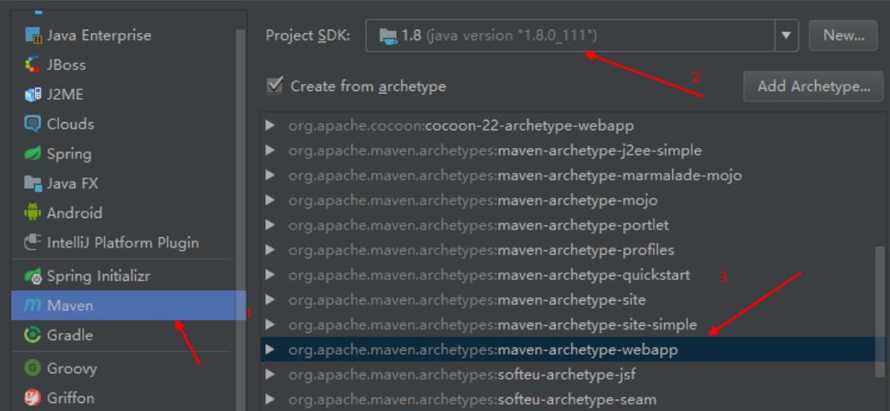
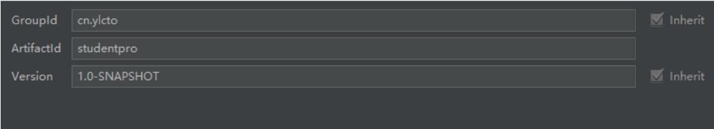
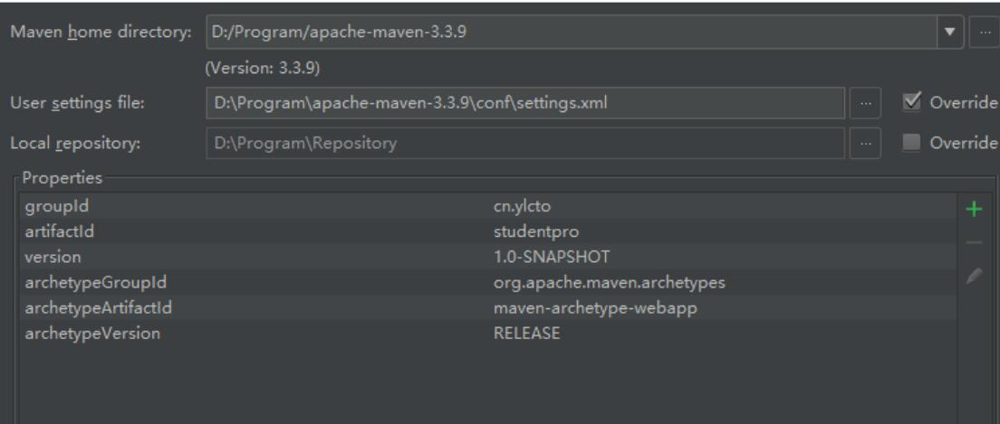
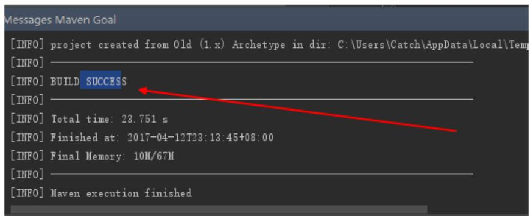
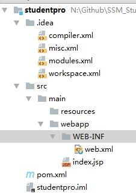
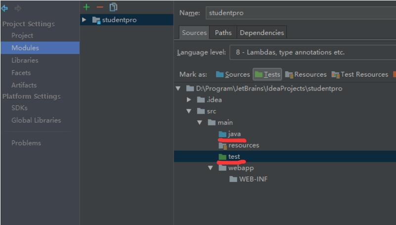
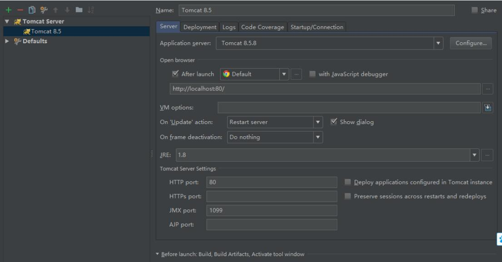
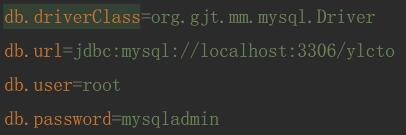

# 2017.06.11 03搭建开发环境(使用IDEA2017开发工具)  
 
1. 结合maven进行项目的创建，项目名称为studentpro  

	- 选择New Project  
	- Maven  
	- 选择SDK(jdk1.8的路径，不用带bin目录)-->Next
		
	- 填写groupid-->"cn.ylcto"，Artifaciid-->"studentpro"-->Next  
		
	- Maven home directory选择maven的安装目录  
	- User settings file勾选Override，选择maven目录下的conf\settings.xml-->Next  
		
	- 选择Project location-->Finish  
	- 第一次使用会下载相关的jar包，耐心等待...  
		  
		如果出现如图所示，表明项目已经创建成功
		
1. 配置项目环境

	- 项目目录结构，如图所示  
	
		

	- 现在不能创建java程序的编写操作，需要在src下创建java和test包  
		
	- 在项目中配置tomcat8.5
		
	- 修改pom.xml  
	- 将相关的资源文件拷贝到resouces目录中  
	- 配置数据库资源文件  
		
	- 配置web.xml  
	- 在资源文件目录中增加mapper.xml文件  
	