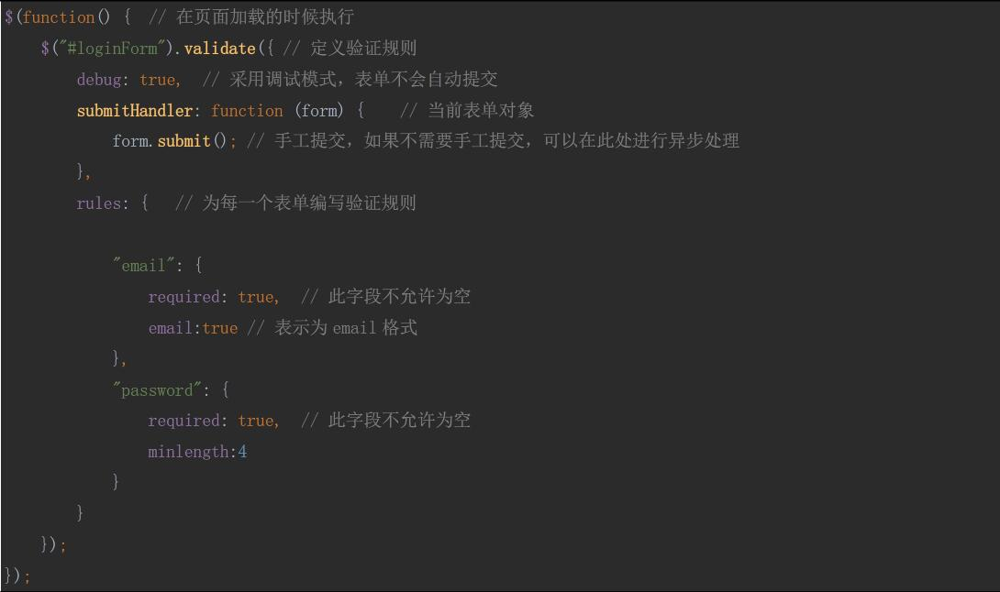

# 2017.06.24 10管理员登录前台页面编写
在webapp目录下建立一个pages/back的文件夹
导入相关的js和css文件
需要导入login.html页面
需要在页面中导入basepath
将forward.jsp页面拷贝到pages目录下

1. 修改login.jsp页面  
	  
1. 验证登录数据是否存在
	  
	基于jquery验证框架完成的验证操作相对简单，如果不会使用只需要修改admin_login.js文件即可。  