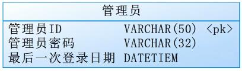
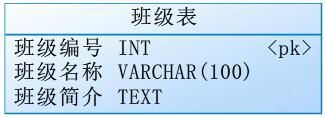
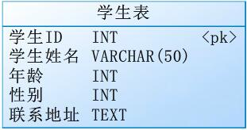
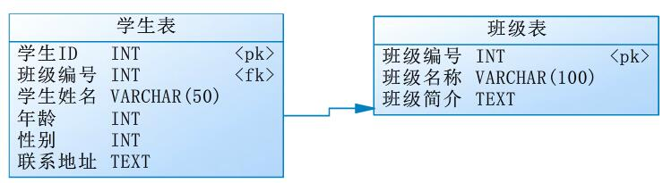

# SSM学生信息管理系统  


## 章节①   项目开发准备

### 01项目准备

1. 实现语言  
  使用JAVA语言开发

2. 环境要求  
  IDEA2017、JDK8、Tomcat8.5、MySQL5.5。

3. 项目功能要求  
  采用SSM（Spring4.x + Spring4.x + MyBatis3.x + Maven3.x）实现学生管理系统，本次使用MysQL5.5作为本次开发的数据库。系统功能包括：  

  管理员登录模块  

  - 管理员登录功能实现  
  - 登录注销  
  - 最后一次登录日期  

  班级模块

  - 实现班级增加操作  
  - 实现班级列表操作（不实现分页操作）  
  - 在列表的基础上实现更新操作，使用异步更新（不需要通过id查询数据的方式完成）  
  - 在列表的基础上实现批量删除操作  

  学生模块开发

  - 实现学生模块操作
  - 实现学生列表操作（使用异步更新操作，并实现分页）  
  - 实现通过班级编号查询班级全部学生信息（使用异步刷新操作，并实现分页）  
  - 在列表的基础上实现更新学生信息  
  - 在列表的基础上实现批量实现学生信息（逻辑删除）  

4. 项目前端技术。  
  本次项目使用的前端技术包括：BootStrap、json、html、css、javascript。

## 02数据库设计(使用PD设计工具)

1. 建立管理员表  

  - 管理员ID  
  - 管理员密码  
  - 最后一次登录日期  

    

2. 建立班级表

  - 班级编号  
  - 班级名称  
  - 班级简介  

    

3. 建立学生表  

  - 学生编号  
  - 学生姓名  
  - 年龄  
  - 性别  
  - 联系地址  

    

4. 对应关系  

  一个学生属于一个班级，一个班级有多个学生  

  
5. 编写数据库创建脚本  
  数据库名为ylcto

6. 数据库脚本sql  

```sql
-- 删除数据库
DROP DATABASE ylcto;
-- 创建删除库
CREATE DATABASE ylcto;
-- 使用数据库
USE ylcto;
-- 删除数据表
DROP TABLE admin;
DROP TABLE classes;
DROP TABLE sutdent;

-- 创建数据表
-- 1、创建管理员表
CREATE TABLE admin(
   email                VARCHAR(50) NOT NULL,
   password             VARCHAR(32),
   lastdate             DATE,
   CONSTRAINT pk_email PRIMARY KEY (email)
);

-- 2、创建班级表
CREATE TABLE classes(
   cid                  INT NOT NULL AUTO_INCREMENT,
   cname                VARCHAR(100),
   note                 TEXT,
    CONSTRAINT pk_cid PRIMARY KEY (cid)
);

-- 3、创建学生表
CREATE TABLE student(
   sid                  VARCHAR(50) NOT NULL,
   cid                  INT,
   name                 VARCHAR(50),
   age                  INT,
   sex                  INT,
   address              TEXT,
   CONSTRAINT pk_sid PRIMARY KEY (sid),
   CONSTRAINT fk_cid FOREIGN KEY (cid) REFERENCES classes(cid) ON DELETE SET NULL
);
-- 提交
COMMIT;
```

## 03搭建开发环境(使用IDEA2017开发工具)

1. 结合maven进行项目的创建，项目名称为studentpro  

  - 选择New Project  
  - Maven  
  - 选择SDK(jdk1.8的路径，不用带bin目录)-->Next
    
  - 填写groupid-->"cn.ylcto"，Artifaciid-->"studentpro"-->Next  
    
  - Maven home directory选择maven的安装目录  
  - User settings file勾选Override，选择maven目录下的conf\settings.xml-->Next  
    
  - 选择Project location-->Finish  
  - 第一次使用会下载相关的jar包，耐心等待...  
      
    如果出现如图所示，表明项目已经创建成功
    
2. 配置项目环境

  - 项目目录结构，如图所示  

    

  - 现在不能创建java程序的编写操作，需要在src下创建java和test包  
    

  - 在项目中配置tomcat8.5
    

  - 修改pom.xml  

  - 将相关的资源文件拷贝到resouces目录中  

  - 配置数据库资源文件  
    ```java
    db.driverClass=org.gjt.mm.mysql.Driver
    db.url=jdbc:mysql://localhost:3306/ylcto
    db.user=root
    db.password=123456
    ```

  - 配置web.xml  

  - 在资源文件目录中增加mapper.xml文件  

## 04管理员模块项目准备

1. 增加测试数据  
  ```sql
  -- 增加测试数据
  -- id:ylcto@163.com password:ylcto
  INSERT INTO admin(email, password,lastdate) VALUES ('ylcto@163.com','22BB09850349B763292456715CC5E25F','1999-9-9');
  ```
2. 编写公共DAO(IDAO.java)  
  ```java
  package cn.ylcto.student.dao;
  import java.sql.SQLException;
  import java.util.List;
  import java.util.Set;

  /**
   * 这个接口表示一个公共DAO接口
   * @param <K> 表示主键
   * @param <V> 表示要操作的对象
   */
  public interface IDAO<K,V> {
      /**
       * 实现数据增加操作
       * @param vo 表示要执行操作的对象
       * @return 成功返回true,失败返回false
       * @throws SQLException
       */
      public boolean doCreate(V vo)throws SQLException;

      /**
       * 实现数据操作
       * @param vo 表示要执行更新对象
       * @return 成功返回true,失败返回false
       * @throws SQLException
       */
      public boolean doUpdate(V vo) throws SQLException;

      /**
       * 实现数据批量删除
       * @param ids 表示要执行删除的数据集合
       * @return 成功返回true,失败返回false
       * @throws SQLException
       */
      public boolean doRemove(Set<?> ids)throws SQLException;

      /**
       * 根据用户提供的id进行查询
       * @param id 表使用执行查询的行
       * @return 查询成功返回该数据行中的记录，失败返回null
       * @throws SQLException
       */
      public V findById(K id)throws SQLException;

      /**
       * 实现数据全部查询
       * @return 成功返回全部数据，失败返回null
       * @throws SQLException
       */
      public List<V> findAll()throws SQLException;

      /**
       * 实现数据分页操作
       * @param column 表示要执行查询列
       * @param keyWord 表示查询关键字
       * @param currentPage 表示当前页
       * @param lineSize 表示每页显示记录数
       * @return 成功返回满足条件的数据，失败返回null
       * @throws SQLException
       */
      public List<V> findAllBySplit(String column, String keyWord, Integer currentPage, Integer lineSize)throws SQLException;

      /**
       * 实现数据量统计操作
       * @param column 表示要执行统计列
       * @param keyWord 表示统计查询关键字
       * @return 成功返回数据量，失败返回 0
       * @throws SQLException
       */
      public Integer getAllCount(String column, String keyWord)throws SQLException;
  }
  ```